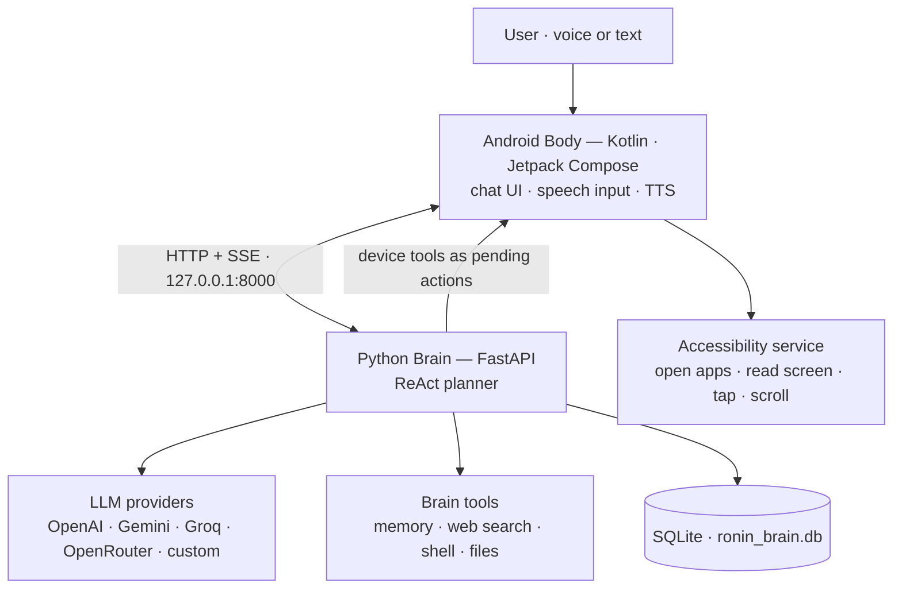
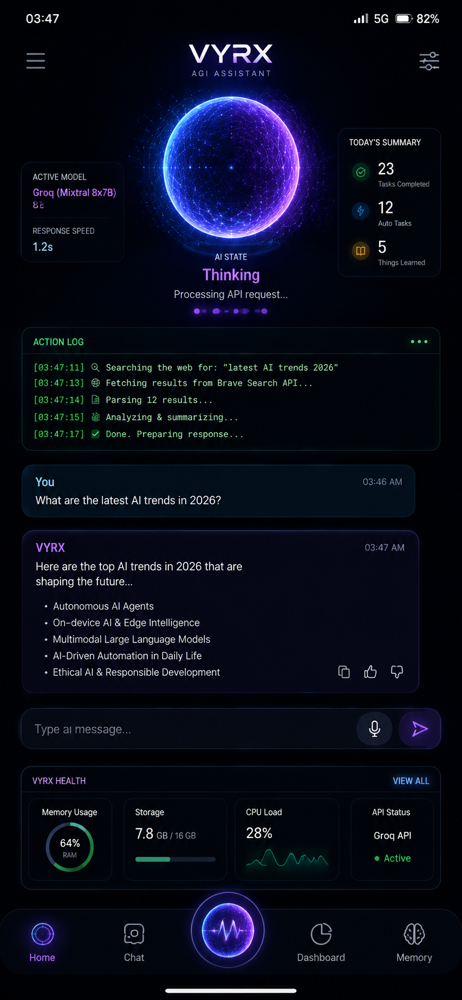
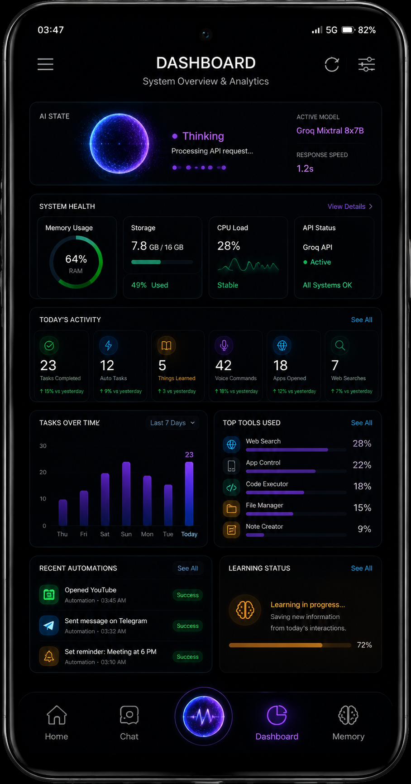
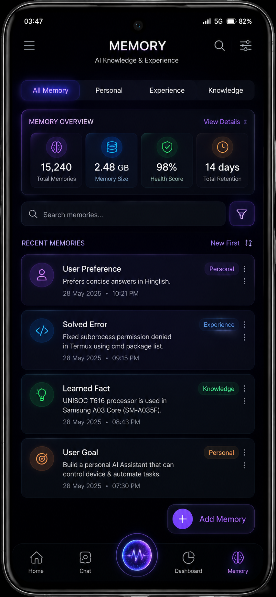

<div align="center">

# VYRX

**An agentic AI assistant that runs on one Android device — a Python Brain that
reasons and acts, and a native Kotlin Body that drives the phone.**

[](RONIN_Body_Kotlin/app/build.gradle)
[](RONIN_Body_Kotlin/build.gradle)
[](RONIN_Body_Kotlin/app/build.gradle)
[](RONIN_Brain_Python/main.py)
[](RONIN_Brain_Python/memory/db_manager.py)
[](docs/REALTIME_STREAMING.md)
[](RONIN_Body_Kotlin/gradle/wrapper/gradle-wrapper.properties)

[Architecture](docs/AGENTIC_ARCHITECTURE.md) · [Streaming protocol](docs/REALTIME_STREAMING.md) · [API](#api--communication) · [Getting started](#getting-started)

</div>

> **Naming:** the product is **VYRX**. Internal modules still carry their
> historical **RONIN** names — `RONIN_Brain_Python/`, `RONIN_Body_Kotlin/`,
> the `com.ronin.ai` package, the `ronin_brain.db` database, and the app label
> ("RONIN") on the launcher. Same project; the rename hasn't happened yet.

---

## What is VYRX?

VYRX is a two-part agent that answers voice or text requests by *acting* on the
device — opening apps, reading the screen, tapping, searching the web,
remembering facts — instead of only replying.

**Brain — `RONIN_Brain_Python/`**
A FastAPI service (default `127.0.0.1:8000`) that runs a ReAct agent loop:
plan → tool call → observation → verify, with self-correction on failure.
It talks to multiple LLM providers, executes Brain-side tools, dispatches
device-side tools to the Body, persists memory in SQLite, and streams the whole
loop to clients over Server-Sent Events. It is designed to run on the same
device as the Body (e.g. inside Termux).

**Body — `RONIN_Body_Kotlin/`**
A Kotlin/Jetpack Compose Android app: chat UI with a live "thought terminal",
speech input, text-to-speech output, encrypted provider-key storage, and the
accessibility-driven executor that runs the Brain's device tools. It
health-checks the Brain and can auto-start it through Termux.

## Architecture



1. A request hits `POST /ask_ronin`. The planner injects relevant memories and
   calls the configured LLM provider — native function calling, with a strict
   `<tool>` JSON-tag fallback for providers that don't support it.
2. Brain tools run inline in Python. Device tools are returned as pending
   `AgentAction`s; the Body executes them via accessibility and POSTs the
   observation back to `POST /agent/result` — the loop continues on the same
   SSE connection.
3. The agent verifies each observation, self-corrects after failures, fails
   over to the next configured provider, and stops after 8 reasoning steps.
4. The final answer streams back chunk-by-chunk (typing effect), with every
   `thinking` / `tool_call` / `observation` frame visible along the way.

Details: [docs/AGENTIC_ARCHITECTURE.md](docs/AGENTIC_ARCHITECTURE.md) ·
[docs/REALTIME_STREAMING.md](docs/REALTIME_STREAMING.md)

## Capabilities

**Agent core (Brain)**
- ReAct loop with self-correction and an 8-step budget (summarizes instead of looping)
- Multi-provider LLM calls with automatic failover; offline keyword fallback keeps explicit commands like "open X" working with zero API keys
- 7 Brain-side tools: `save_memory`, `retrieve_memory`, `search` (DuckDuckGo instant answers), `run_termux_command` (blocklist-guarded shell), `read_file`, `write_file`, `list_files` (workspace-scoped)
- Dynamic tool creation: model-proposed Python tools, syntax-checked and applied only after explicit approval via `POST /approve_update`

**Device control (Body)**
- 11 device tools: `open_app`, `read_screen`, `click_xy`, `click_node`, `click`, `set_text`, `scroll`, `press_back`, `press_home`, `get_notifications`, `list_apps`
- Accessibility implementation: screen-tree dump, coordinate/node/text taps, text setting, scrolling; app launching resolves via PackageManager with exact-then-fuzzy matching
- Dispatched actions execute in the background — no user tap per step (max 8 round-trips)
- Voice in (SpeechRecognizer via a microphone foreground service) and voice out (TextToSpeech)

**Memory**
- SQLite store for conversation history and facts; keyword-ranked recall injected into every prompt
- The agent saves corrections and preferences proactively (`save_memory`); memories are editable through a CRUD API and the Memory screen

**Streaming & observability**
- SSE stream of the whole loop — 13 event types from `start` to `done`, ~10 s keep-alive comments, per-frame `seq` ordering
- Live thought terminal inside the chat bubble; per-message copy / feedback actions
- Browser status dashboard at `GET /` — AI state, CPU/RAM/storage read from `/proc` (no psutil), daily activity, live action log
- Per-provider request/error/latency metrics, kept for the last 7 days

## Technology stack

| Layer | Technology (verified in build files / imports) |
|---|---|
| Brain | Python 3 · FastAPI · Uvicorn · Pydantic · SQLite (`aiosqlite` + `sqlite3`) · `requests` · SSE via `StreamingResponse` |
| Body | Kotlin 1.9.24 · Jetpack Compose (BOM 2024.09.03, Material 3) · AndroidX Navigation · OkHttp 4.12.0 + `okhttp-sse` · kotlinx-coroutines 1.8.1 |
| Body security | AndroidX Security Crypto 1.1.0-alpha06 (EncryptedSharedPreferences) · AndroidX Biometric 1.1.0 |
| Android target | minSdk 26 · target/compileSdk 35 · Java 17 toolchain |
| Build & CI | Gradle 8.7 wrapper · Android Gradle Plugin 8.6.1 · GitHub Actions (build + debug-APK release) |

## Project structure

```
My_VYRX/
├── RONIN_Brain_Python/              # VYRX Brain — FastAPI agent service
│   ├── main.py                      #   API surface: agent, memory, providers, SSE, dashboard
│   ├── core/                        #   planner, LLM handler, streaming, capability registry
│   ├── memory/                      #   SQLite schema + memory engine (ronin_brain.db)
│   ├── tools/                       #   Brain-side tools (memory, web, shell, files)
│   ├── config/                      #   settings.json · providers.json · device_status.json
│   ├── tests/                       #   pytest/unittest suite
│   ├── devtools/stream_preview.py   #   terminal "fake Body" for the live stream
│   └── start_brain.sh               #   Termux launcher (single-instance guarded)
├── RONIN_Body_Kotlin/               # VYRX Body — Android app (single :app module)
│   └── app/src/main/java/com/ronin/ai/
│       ├── ui/                      #   Compose screens: chat, memory, dashboard, tools, settings
│       ├── network/                 #   OkHttp/SSE client + Brain auto-start via Termux
│       ├── services/                #   accessibility, notification listener, voice
│       ├── security/                #   app-lock components (see Security notes)
│       └── data/                    #   encrypted settings + provider repositories
├── docs/                            # architecture, streaming protocol, stability notes
└── VYRX_UI_Design_Documentation/    # screen mockups + design notes
```

## Getting started

Requirements: Python 3 with pip; for the Android app, JDK 17 and an Android
SDK with API 35. No API keys are needed to boot the Brain — keys ride on each
request (see [Configuration](#configuration)).

### Python Brain

```bash
cd RONIN_Brain_Python
pip install -r requirements.txt

# Watch a complete agent turn stream in your terminal — no phone, no API keys:
python3 devtools/stream_preview.py "open youtube" --fake-llm

# Run the server (binds 127.0.0.1:8000):
python3 main.py
# or, to expose it on the network (what start_brain.sh does on-device):
uvicorn main:app --host 0.0.0.0 --port 8000

curl http://127.0.0.1:8000/health        # {"status":"ok"}
```

Then open <http://127.0.0.1:8000/> for the live status dashboard.

### Android Body

```bash
cd RONIN_Body_Kotlin
bash gradlew :app:assembleDebug          # same command the CI uses
```

- APK output: `app/build/outputs/apk/debug/`
- No local toolchain? Pushes to `main` run the *Build Android APK* workflow,
  which uploads a `VYRX-debug-apk` artifact and publishes a `latest-debug`
  GitHub release.
- On first launch: add a provider key in the **API Providers** screen, and
  enable **Accessibility** access plus **Notification** access in Android
  settings so device tools can run.

### On-device (Termux)

The Body talks to the Brain at `127.0.0.1:8000`, so both run on the phone.
If Termux is installed and the Brain lives at
`/mnt/sdcard/terai/RONIN_Workspace/RONIN_Brain_Python` (the path the Body's
auto-start expects), the app health-checks the Brain and can start it
automatically through Termux's `RUN_COMMAND` service via `start_brain.sh`
(single-instance guarded, stale-PID safe).

## Configuration

| Where | What it controls |
|---|---|
| `RONIN_Brain_Python/config/settings.json` | `tool_execution_mode`, `developer_mode`, `allow_dynamic_tools` |
| `RONIN_Brain_Python/config/providers.json` | Auto-managed: provider enable flags, model/endpoint overrides, per-day metrics. **Never stores API keys.** |
| `RONIN_Brain_Python/config/device_status.json` | Last capability report from the Body (accessibility, notifications, microphone) |
| Environment variables | `OPENAI_API_KEY`, `GEMINI_API_KEY`, `GROQ_API_KEY`, `OPENROUTER_API_KEY` — fallbacks when a request carries no key |
| In-app (Body) | Provider keys, models and custom endpoints — stored encrypted on the device |

The Brain's runtime settings ship as:

```json
{ "tool_execution_mode": "full", "developer_mode": true, "allow_dynamic_tools": true }
```

The Body's target URL is fixed to `http://127.0.0.1:8000` (`network/ApiClient.kt`).

## API & communication

All endpoints below are implemented in `RONIN_Brain_Python/main.py`.

| Method | Endpoint | Purpose |
|---|---|---|
| `POST` | `/ask_ronin` | Full agent turn — JSON, or SSE when `Accept: text/event-stream` / `{"stream": true}` |
| `POST` | `/ask_ronin/stream` | Always-stream alias (handy for `curl -N`) |
| `POST` | `/agent/result` | Body → Brain tool-result callback; continues the ReAct loop |
| `GET` | `/agent/tools` | Live tool surface: server + device tool schemas |
| `GET` | `/agent/stream/protocol` | Self-documenting SSE event vocabulary |
| `POST` | `/approve_update` | Approve or reject a proposed self-update |
| `GET` | `/health` | Liveness probe |
| `GET` | `/api/state` `/api/health` `/api/action_logs` `/api/summary` | Orb state · `/proc`-based health · logs · daily activity |
| `GET` | `/api/events` | SSE action-log stream |
| `GET`/`POST` | `/api/memory`, `/api/memory/{id}` (`DELETE`) | Memory CRUD |
| `GET`/`POST` | `/api/providers` | Provider enable/model/endpoint updates (no keys) |
| `GET` | `/api/tools` | Tools catalog with availability |
| `POST` | `/api/device_status` | Body capability report |
| `POST` | `/api/feedback` | Thumb up/down with optional comment |
| `GET` | `/` | Browser status dashboard |

**Streaming.** A streamed turn emits `start`, `thinking`, `thought`,
`tool_call`, `observation`, `self_correction` (alias `reflexion`), `token`,
`answer_end`, `log`, `state`, `done` and `error` frames — each a JSON payload
with a monotonic `seq`. Device tools mid-stream are bridged through
`TOOL_RESULT_BRIDGE` so one connection carries the whole turn. Frame formats:
[docs/REALTIME_STREAMING.md](docs/REALTIME_STREAMING.md).

## Testing

```bash
cd RONIN_Brain_Python
pip install -r tests/requirements.txt
python3 -m pytest tests/ -q
```

(The suite resolves `core.*` imports relative to `RONIN_Brain_Python/`, so run
it from that directory — the same way the project's own docs do.)

- The suite covers the agent loop, the SSE streaming protocol, the capability
  registry and health layer, execution boundaries, stability, and a Brain ↔
  Body contract test that statically asserts the Kotlin sources implement the
  protocol (`tests/test_android_contract.py`) — no device required.
- Provider calls and persistence are mocked; tests never need API keys.
- The repo contains no Kotlin unit or instrumentation tests; CI compiles and
  assembles the debug APK on every PR touching `RONIN_Body_Kotlin/`.

## Documentation

| Document | Contents |
|---|---|
| [docs/AGENTIC_ARCHITECTURE.md](docs/AGENTIC_ARCHITECTURE.md) | ReAct loop, action protocol, device tools, memory, failure semantics |
| [docs/REALTIME_STREAMING.md](docs/REALTIME_STREAMING.md) | SSE transport, event vocabulary, keep-alives, device-tool bridging |
| [docs/mobile-stability-validation.md](docs/mobile-stability-validation.md) | Mobile UX decisions, deliberate limitations, manual validation steps |
| `VYRX_UI_Design_Documentation/` | Per-screen mockups and design notes |

<details>
<summary>UI design references (mockups, not runtime screenshots)</summary>

<br>

<p align="center">
  
  
  
</p>

These are the design mockups stored in `VYRX_UI_Design_Documentation/`.
They illustrate the intended look of the app — details in them (e.g. the
search provider shown) do not necessarily reflect the current implementation.

</details>

## Security notes

Mechanisms that are actually implemented:

- **Keys never rest on the Brain.** Provider API keys live in
  `EncryptedSharedPreferences` (Android Keystore-backed) on the device and are
  sent per request. The Brain records only that a key was seen, plus metrics.
- **Biometric gate.** AndroidX `BiometricPrompt` guards the in-app security
  settings; app settings are also stored encrypted.
- **Guarded shell and file tools.** `run_termux_command` refuses a destructive
  command blocklist; file writes are confined to the Brain workspace with an
  extension allowlist and Python syntax checks.
- **Approval-gated self-updates.** Proposed code changes are applied only via
  `/approve_update`, stay inside the Brain directory, are syntax-validated,
  backed up as `.bak`, and rolled back on failure.

Honest limitations:

- The manifest declares a broad permission set (contacts, phone/SMS, camera,
  location, storage, overlay, and more) that exceeds what the current code
  exercises.
- Cleartext HTTP is enabled — required for the local `http://127.0.0.1:8000`
  loopback API.
- Several manifest components are inert compatibility stubs, not features:
  boot receiver, quick-settings tile, device admin, call monitor, overlay
  service, and the pattern/app-lock activities. Boot does not start any
  restricted foreground service.
- No external security audit has been performed. See
  [docs/mobile-stability-validation.md](docs/mobile-stability-validation.md)
  for the author's own scope notes.

## Contributing

Issues and pull requests are welcome. CI builds the Android app for every PR
that touches `RONIN_Body_Kotlin/`; please run the Python test suite (above)
before submitting changes to the Brain.

<!-- No LICENSE file exists in this repository yet. -->
